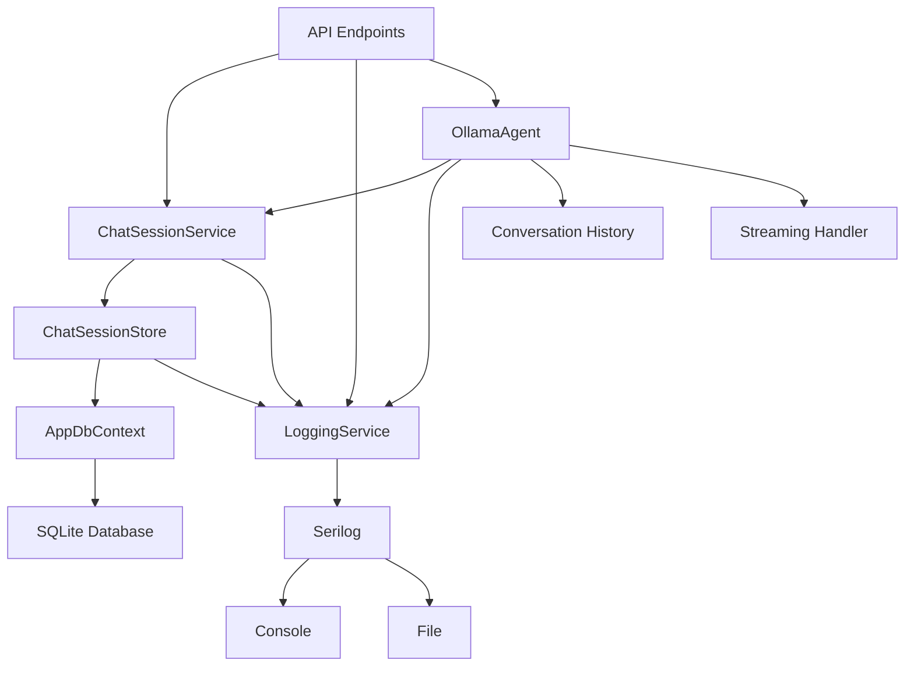

# System Patterns

## Architecture Overview
The application follows a clean architecture approach with clear separation of concerns:

1. **API Layer** (Program.cs)
   - Minimal API endpoints
   - Request/Response DTOs
   - Dependency injection setup
   - Streaming response endpoints

2. **Domain Layer** (Chat/)
   - Chat session management
   - Business logic
   - Domain models
   - Service interfaces
   - Store interfaces
   - Conversation history management

3. **Infrastructure Layer** (Infra/)
   - Data persistence
   - Store implementations
   - Cross-cutting concerns
   - Logging system
   - Database context

4. **Agents Layer** (Agents/)
   - LLM integration
   - Chat agent implementation
   - Streaming support
   - Session management
   - Conversation history
   - Deferred message processing

## Design Patterns

### Store Pattern
- IChatSessionStore defines session operations
- ChatSessionStore implements session logic
- Direct Entity Framework Core integration
- SQLite for storage
- Manages session state and persistence
- Handles conversation history

### Service Pattern
- IChatSessionService defines business logic
- ChatSessionService implements operations
- Uses store for data access
- Handles session management
- Manages conversation flow

### Dependency Injection
- Services registered in Program.cs
- Interface-based design for loose coupling
- Constructor injection
- Scoped lifetime for services
- Agent registration

### Logging Pattern
- Structured logging with Serilog
- Console and file output
- Log rotation
- Context enrichment
- Performance tracking
- ILoggingService abstraction
- LoggingService implementation
- Streaming response logging

### Testing Pattern
- MSTest for test framework
- NSubstitute for mocking
- In-memory database for testing
- Comprehensive unit tests
- Integration test support
- Streaming response tests

### Streaming Pattern
- Server-Sent Events for streaming
- Deferred message processing
- Conversation history management
- In-memory state tracking
- Error handling for streams

## Component Relationships

## Key Interfaces
1. `IChatSessionStore`: Session management contract
2. `IChatSessionService`: Business logic contract
3. `AppDbContext`: Data access abstraction
4. `ILoggingService`: Logging abstraction
5. `ILlmAgent`: LLM integration contract
6. `IOllamaApiClient`: Ollama client contract

## Error Handling
- Exception handling in repositories
- Exception handling in services
- Graceful error responses
- Session state management
- Structured error logging
- Test coverage for error scenarios
- Streaming error handling
- Conversation error recovery 