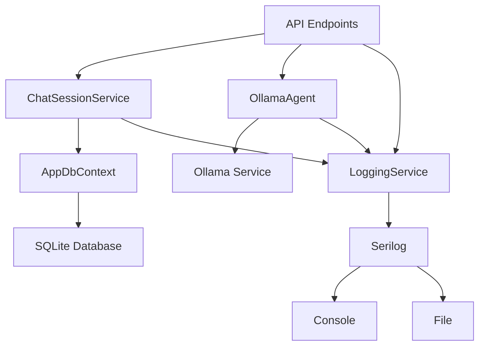

# System Patterns

## Architecture Overview
The application follows a clean architecture approach with clear separation of concerns:

1. **API Layer** (Program.cs)
   - Minimal API endpoints
   - Request/Response DTOs
   - Dependency injection setup

2. **Domain Layer** (Chat/)
   - Chat session management
   - Business logic
   - Domain models

3. **Infrastructure Layer** (Infra/)
   - Data persistence
   - External service integration
   - Cross-cutting concerns
   - Logging system

## Design Patterns

### Repository Pattern
- ChatSessionService implements chat session persistence
- Entity Framework Core for data access

### Dependency Injection
- Services registered in Program.cs
- Interface-based design for loose coupling

### Streaming Pattern
- Server-Sent Events for real-time responses
- Asynchronous streaming with IAsyncEnumerable

### Session Management
- Unique session IDs for chat conversations
- Persistent storage of chat history

### Logging Pattern
- Structured logging with Serilog
- Console and file output
- Log rotation
- Context enrichment
- Performance tracking

## Component Relationships

## Key Interfaces
1. `ILlmAgent`: LLM interaction contract
2. `IChatSessionService`: Chat session management
3. `AppDbContext`: Data access abstraction
4. `ILoggingService`: Logging abstraction

## Error Handling
- Exception handling in streaming endpoints
- Graceful error responses
- Session state management
- Structured error logging 