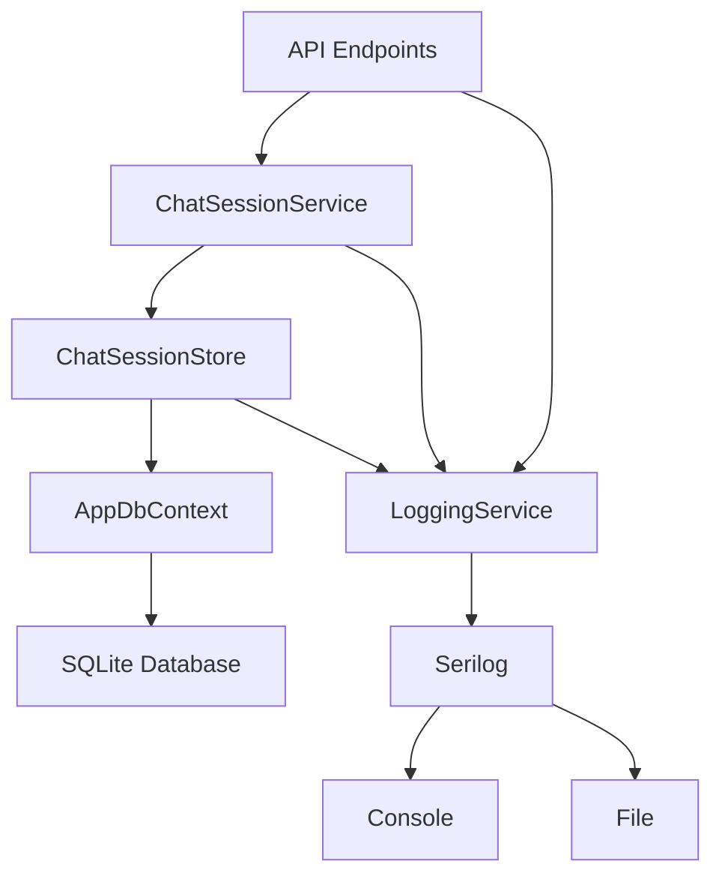

# System Patterns

## Architecture Overview
The application follows a clean architecture approach with clear separation of concerns:

1. **API Layer** (Program.cs)
   - Minimal API endpoints
   - Request/Response DTOs
   - Dependency injection setup

2. **Domain Layer** (Chat/)
   - Chat session management
   - Business logic
   - Domain models
   - Service interfaces
   - Store interfaces

3. **Infrastructure Layer** (Infra/)
   - Data persistence
   - Store implementations
   - Cross-cutting concerns
   - Logging system

## Design Patterns

### Store Pattern
- IChatSessionStore defines session operations
- ChatSessionStore implements session logic
- Direct Entity Framework Core integration
- SQLite for storage
- Manages session state and persistence

### Service Pattern
- IChatSessionService defines business logic
- ChatSessionService implements operations
- Uses store for data access
- Handles session management

### Dependency Injection
- Services registered in Program.cs
- Interface-based design for loose coupling
- Constructor injection
- Scoped lifetime for services

### Logging Pattern
- Structured logging with Serilog
- Console and file output
- Log rotation
- Context enrichment
- Performance tracking

## Component Relationships

## Key Interfaces
1. `IChatSessionStore`: Session management contract
2. `IChatSessionService`: Business logic contract
3. `AppDbContext`: Data access abstraction
4. `ILoggingService`: Logging abstraction

## Error Handling
- Exception handling in repositories
- Exception handling in services
- Graceful error responses
- Session state management
- Structured error logging 